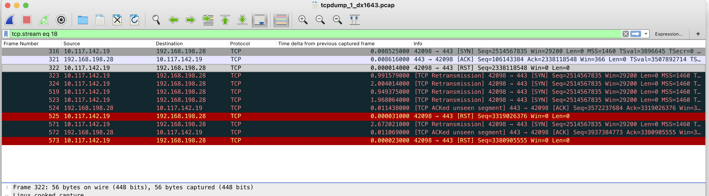

### ASA/FTD Firewall dropping RST from Client after Server's Challenge-ACK

**Symptom**

Firewall dropping RST from Client after Server's "Challenge ACK" preventing client from establishing TCP connections to server.

**Environment**

1. Any client-server architecture where the Server is configured to mitigate "Blind Reset Attack Using the SYN Bit" and sends "Challenge-ACK"

2. As a response to client's SYN, the Server challenges by sending an ACK to confirm the loss of the previous connection and the request to start a new connection.

3. This challenge ACK has acknowledgment number from previous connection and upon seeing the unexpected ACK, client sends a RST; thus tearing down TCP connection on the server also.

4. RFC5961: https://tools.ietf.org/html/rfc5961#section-4

5. Sample packet capture explaining such a flow:

        > First ACK from the server has acknowledgement number different than SYN's sequence number.
        > Client responding with RST with sequence number derived from challenge ACK.
        > Upon receiving the RST, Server tears down old TCP connection and relies on the SYN retransmission from the client end to re-establish the connection.

**Cause**

1. When ASA/FTD firewall is placed between such client and server, it doesn't understand such a flow by default.

2. Firewall forwards the ACK received from server to the client however the RST from client is dropped by firewall.

15:36:43.524234       10.117.142.19.42098 > 192.168.198.28.443: R 2338118548:2338118548(0) win 0 Drop-reason: (tcp-rstfin-ooo) TCP RST/FIN out of order, Drop-location: frame 0x000055870affc2df flow (NA)/NA

**LAB Replay Test Results**

When packets were replayed in lab following was seen:

Client IP address 10.117.142.19
Sever IP address 192.168.198.28

Ingress Interface --> Inside
Egress Interface  --> DMZ

When packets were replayed in lab following was seen:

ciscoasa(config-pmap-c)#    sh conn address 192.168.198.28 long

27 in use, 17252 most used

Flags: A - awaiting inside ACK to SYN, a - awaiting outside ACK to SYN,

       B - initial SYN from outside, b - TCP state-bypass or nailed,

       C - CTIQBE media, c - cluster centralized,

       D - DNS / Umbrella, d - dump, E - outside back connection, e - semi-distributed,

       F - outside FIN, f - inside FIN,

       G - group, g - MGCP, H - H.323, h - H.225.0, I - inbound data,

       i - incomplete, J - GTP, j - GTP data, K - GTP t3-response

       k - Skinny media, L - LISP triggered flow owner mobility

       l - local director/backup stub flow

       M - SMTP data, m - SIP media, n - GUP

       N - inspected by Snort

       O - outbound data, o - offloaded,

       P - inside back connection

       Q - Diameter, q - SQL*Net data,

       R - outside acknowledged FIN,

       R - UDP SUNRPC, r - inside acknowledged FIN, S - awaiting inside SYN,

       s - awaiting outside SYN, T - SIP, t - SIP transient, U - up, u - STUN,

       V - VPN orphan, v - M3UA W - WAAS,

       w - secondary domain backup,

       X - inspected by service module,

       x - per session, Y - director stub flow, y - backup stub flow,

       Z - Scansafe redirection, z - forwarding stub flow
 

TCP inside: 10.117.142.19/42098 (10.117.142.19/42098) dmz: 192.168.198.28/443 (192.168.198.28/443), flags SaAB , idle 0s, uptime 7s, timeout 30s, bytes 0

  Initiator: 10.117.142.19, Responder: 192.168.198.28

ciscoasa(config-pmap-c)#   sh logging | i 10.117.142.19

May 18 2025 08:14:55: %ASA-7-815004: OGS: Packet TCP from inside:10.117.142.19/42098 to dmz:192.168.198.28/443 matched (1) source network objects and (0) destination network objects total search entries (0). Resultant key-set has (1) entries

May 18 2025 08:14:55: %ASA-6-302013: Built inbound TCP connection 207860548 for inside:10.117.142.19/42098 (10.117.142.19/42098) to dmz:192.168.198.28/443 (192.168.198.28/443)

May 18 2025 08:15:03: %ASA-6-302014: Teardown TCP connection 207860548 for inside:10.117.142.19/42098 to dmz:192.168.198.28/443 duration 0:00:08 bytes 0 TCP Reset-O from inside

May 18 2025 08:15:04: %ASA-7-815004: OGS: Packet TCP from inside:10.117.142.19/42098 to dmz:192.168.198.28/443 matched (1) source network objects and (0) destination network objects total search entries (0). Resultant key-set has (1) entries

May 18 2025 08:15:04: %ASA-6-302013: Built inbound TCP connection 207860570 for inside:10.117.142.19/42098 (10.117.142.19/42098) to dmz:192.168.198.28/443 (192.168.198.28/443)

May 18 2025 08:15:06: %ASA-6-302014: Teardown TCP connection 207860570 for inside:10.117.142.19/42098 to dmz:192.168.198.28/443 duration 0:00:02 bytes 0 TCP Reset-O from inside

ciscoasa(config-pmap-c)# sh capture capi

12 packets captured

   1: 08:14:55.463812       10.117.142.19.42098 > 192.168.198.28.443: S 2514567835:2514567835(0) win 29200 <mss 1460,nop,nop,timestamp 3896645 0,nop,wscale 7>

   2: 08:14:56.464178       192.168.198.28.443 > 10.117.142.19.42098: . ack 969796095 win 366 <nop,nop,timestamp 3507892714 2317016501>

   3: 08:14:57.464087       10.117.142.19.42098 > 192.168.198.28.443: R 2338118548:2338118548(0) win 0

   4: 08:14:58.464041       10.117.142.19.42098 > 192.168.198.28.443: S 2514567835:2514567835(0) win 29200 <mss 1460,nop,nop,timestamp 3897648 0,nop,wscale 7>

   5: 08:14:59.463950       10.117.142.19.42098 > 192.168.198.28.443: S 2514567835:2514567835(0) win 29200 <mss 1460,nop,nop,timestamp 3899652 0,nop,wscale 7>

   6: 08:15:00.463965       10.117.142.19.42098 > 192.168.198.28.443: S 2514567835:2514567835(0) win 29200 <mss 1460,nop,nop,timestamp 3903664 0,nop,wscale 7>

   7: 08:15:01.464255       10.117.142.19.42098 > 192.168.198.28.443: S 2514567835:2514567835(0) win 29200 <mss 1460,nop,nop,timestamp 3911680 0,nop,wscale 7>

   8: 08:15:02.464224       192.168.198.28.443 > 10.117.142.19.42098: . ack 1950703923 win 366 <nop,nop,timestamp 3507907749 2317016501>

   9: 08:15:03.464117       10.117.142.19.42098 > 192.168.198.28.443: R 3319026376:3319026376(0) win 0

  10: 08:15:04.463873       10.117.142.19.42098 > 192.168.198.28.443: S 2514567835:2514567835(0) win 29200 <mss 1460,nop,nop,timestamp 3927712 0,nop,wscale 7>

  11: 08:15:05.464117       192.168.198.28.443 > 10.117.142.19.42098: . ack 2373587500 win 366 <nop,nop,timestamp 3507923781 2317016501>

  12: 08:15:06.464331       10.117.142.19.42098 > 192.168.198.28.443: R 3380905555:3380905555(0) win 0

12 packets shown

ciscoasa(config-pmap-c)# sh capture capd

11 packets captured

 

   1: 08:14:55.463934       10.117.142.19.42098 > 192.168.198.28.443: S 3882890288:3882890288(0) win 29200 <mss 1380,nop,nop,timestamp 3896645 0,nop,wscale 7>

   2: 08:14:56.464148       192.168.198.28.443 > 10.117.142.19.42098: . ack 2338118548 win 366 <nop,nop,timestamp 3507892714 2317016501>

   3: 08:14:58.464072       10.117.142.19.42098 > 192.168.198.28.443: S 3882890288:3882890288(0) win 29200 <mss 1380,nop,nop,timestamp 3897648 0,nop,wscale 7>

   4: 08:14:59.463965       10.117.142.19.42098 > 192.168.198.28.443: S 3882890288:3882890288(0) win 29200 <mss 1380,nop,nop,timestamp 3899652 0,nop,wscale 7>

   5: 08:15:00.464011       10.117.142.19.42098 > 192.168.198.28.443: S 3882890288:3882890288(0) win 29200 <mss 1380,nop,nop,timestamp 3903664 0,nop,wscale 7>

   6: 08:15:01.464300       10.117.142.19.42098 > 192.168.198.28.443: S 3882890288:3882890288(0) win 29200 <mss 1380,nop,nop,timestamp 3911680 0,nop,wscale 7>

   7: 08:15:02.464194       192.168.198.28.443 > 10.117.142.19.42098: . ack 3319026376 win 366 <nop,nop,timestamp 3507907749 2317016501>

   8: 08:15:03.464148       10.117.142.19.42098 > 192.168.198.28.443: R 392381533:392381533(0) win 0

   9: 08:15:04.464102       10.117.142.19.42098 > 192.168.198.28.443: S 3521885890:3521885890(0) win 29200 <mss 1380,nop,nop,timestamp 3927712 0,nop,wscale 7>

  10: 08:15:05.464087       192.168.198.28.443 > 10.117.142.19.42098: . ack 3380905555 win 366 <nop,nop,timestamp 3507923781 2317016501>

  11: 08:15:06.464361       10.117.142.19.42098 > 192.168.198.28.443: R 93256314:93256314(0) win 0

11 packets shown

 

ciscoasa(config-pmap-c)# sh capture asp

Target:     OTHER

Hardware:   ASAv

Cisco Adaptive Security Appliance Software Version 9.16(4)170

ASLR enabled, text region 5587084fb000-55870c1547e5
 

1 packet captured

   1: 08:14:57.464102       10.117.142.19.42098 > 192.168.198.28.443: R 2338118548:2338118548(0) win 0 Drop-reason: (tcp-rstfin-ooo) TCP RST/FIN out of order, Drop-location: frame 0x000055870affc2df flow (NA)/NA

 1 packet shown

ciscoasa(config-pmap-c)#

Pcaps are attached to article

 Notice that there are two connections which are created, first one is below

 May 18 2025 08:14:55: %ASA-6-302013: Built inbound TCP connection 207860548 for inside:10.117.142.19/42098 (10.117.142.19/42098) to dmz:192.168.198.28/443 (192.168.198.28/443)

This connection is created by first packet ( notice the timestamp )
   1: 08:14:55.463812       10.117.142.19.42098 > 192.168.198.28.443: S 2514567835:2514567835(0) win 29200 <mss 1460,nop,nop,timestamp 3896645 0,nop,wscale 7>

Reset packet sent by 10.117.142.19 in response to challenge ack is dropped by firewall:
   3: 08:14:57.464087       10.117.142.19.42098 > 192.168.198.28.443: R 2338118548:2338118548(0) win 0

The reason this packet is dropped as the sequence number of packet is 2338118548, which is less than the initial sequence number of connection 2514567835, so the packet is drooped with code TCP RST/FIN out of order. This drop can cause delays as challenge/ack exchange is interrupted. 

 Connection is torn down at the following time:

May 18 2025 08:15:03: %ASA-6-302014: Teardown TCP connection 207860548 for inside:10.117.142.19/42098 to dmz:192.168.198.28/443 duration 0:00:08 bytes 0 TCP Reset-O from inside

teardown is due to following packet:

  9: 08:15:03.464117       10.117.142.19.42098 > 192.168.198.28.443: R 3319026376:3319026376(0) win 0

 Notice that this packet is also response to challenge ack packet

   8: 08:15:02.464224       192.168.198.28.443 > 10.117.142.19.42098: . ack 1950703923 win 366 <nop,nop,timestamp 3507907749 2317016501>

Why this reset is not drooped is the Sequence number 3319026376 is valid for this connection, it is greater than initial sequence number 2514567835 of the connection.

The second connection is created:

May 18 2025 08:15:04: %ASA-6-302013: Built inbound TCP connection 207860570 for inside:10.117.142.19/42098 (10.117.142.19/42098) to dmz:192.168.198.28/443 (192.168.198.28/443)

Packet that creates the connection

   10: 08:15:04.463873       10.117.142.19.42098 > 192.168.198.28.443: S 2514567835:2514567835(0) win 29200 <mss 1460,nop,nop,timestamp 3927712 0,nop,wscale 7>

Another challenge ack is sent by server

  11: 08:15:05.464117       192.168.198.28.443 > 10.117.142.19.42098: . ack 2373587500 win 366 <nop,nop,timestamp 3507923781 2317016501> 

reset is sent by client

  12: 08:15:06.464331       10.117.142.19.42098 > 192.168.198.28.443: R 3380905555:3380905555(0) win 0

 This reset the firewall connection

May 18 2025 08:15:06: %ASA-6-302014: Teardown TCP connection 207860570 for inside:10.117.142.19/42098 to dmz:192.168.198.28/443 duration 0:00:02 bytes 0 TCP Reset-O from inside

Again, the reason that reset packet is not dropped is as this is valid, Sequence number: 3380905555 of reset is greater than initial sequence number 2514567835 of connection. 

 

**Observations**

1. While dropping the out of window RST is actually an intended behavior, it breaks the Challenge-ACK mechanism.

2. Following enhancement is open https://bst.cisco.com/bugsearch/bug/CSCwj61793?rfs=qvred

